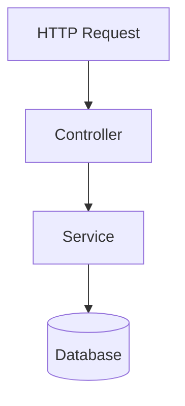

# Business Flow Analysis

Trace data flow: where inputs start, what transforms, where outputs land. Report in chat.

## Entry Point Detection

- **HTTP**: `@RestController`, `@RequestMapping`
- **CLI**: `main()`, command classes
- **Events**: message listeners, pub/sub
- **Scheduled**: `@Scheduled`, cron
- **GUI**: event handlers

## Pattern Recognition

- MVC: Controller → Service → Repository
- Clean Architecture: Presentation → Use Cases → Domain → Infra
- Microservices: Gateway → Service → DB
- Event-Driven: Consumer → Handler → Publisher

## Workflow

1. **Gather**: project type, package structure, entry points, config
2. **Trace** per entry point: input params → method calls → validation → mapping → persistence → output
3. **Categorize**: Input Sources | Business Logic | Output Destinations
4. **Report**

## Report Format

```markdown
# Application Flow Analysis: [Project Name]

## 1. Executive Summary
**Project Type**: [Web Service / CLI / Desktop / Library]
**Architecture**: [MVC / Clean / Microservices / Event-Driven]
**Primary Language**: [Java 17 / Python / TypeScript]
**Entry Points**: [N] identified

Brief 2-3 sentence description.

## 2. Input Sources
- `POST /api/v1/orders` → `OrderController.createOrder()`
- Kafka topic `order.created` → `OrderEventHandler.handle()`

## 3. Business Logic Flow
### [Flow Name]
1. **Input**: Entry point and payload
2. **Validation/Auth**: Checks performed
3. **Processing**: Service orchestration
4. **Persistence**: Database/cache writes
5. **Output**: Response or event

## 4. Output Destinations
- **Database**: `orders` table (insert)
- **External API**: Stripe POST /v1/charges
- **Message Queue**: Kafka topic `order.created`

## 5. Critical Paths
- **Authentication**: JWT via SecurityFilter
- **Error Handling**: @ControllerAdvice → ErrorResponse

## 6. Data Flow Diagram


## 7. Observations
- **Strengths**: ...
- **Concerns**: ...
- **Suggestions**: ...
```

## Standards

- Scannable: headings, bullets
- Concrete: actual class/method names
- Accurate: evidence-based (no speculation)
- Max 300 lines; snippets ≤ 10 lines
- Mermaid: 5-10 nodes max

## Constraints

- Do NOT modify code
- Do NOT analyze tests or generated code
- Max 3 layers deep
- Third-party libs = black boxes
- Large codebases (>100 files): primary flows only
