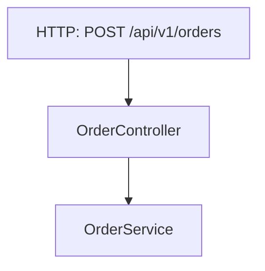

# Technical Report Generation

Turn structured analysis data into scannable Markdown reports: flow analysis, field mapping, architecture, integration specs.

## Operations

### 1. Flow Analysis Report

**Input:**
```yaml
project_name: "Order Processing Service"
project_type: "Web Service"
architecture: "Clean Architecture"
entry_points:
  - method: "POST"
    path: "/api/v1/orders"
    handler: "OrderController.createOrder()"
business_flows:
  - name: "Order Processing"
    steps:
      - layer: "Controller"
        action: "Receive CreateOrderRequest"
      - layer: "Service"
        action: "Validate and process order"
      - layer: "Repository"
        action: "Save to database"
outputs:
  - type: "HTTP Response"
    format: "JSON"
    content: "OrderDTO"
```

**Output structure:**
```markdown
# Application Flow Analysis: [Project Name]
## 1. Executive Summary
## 2. Input Sources
## 3. Business Logic Flow
## 4. Output Destinations
## 5. Critical Paths & Integration Points
## 6. Data Flow Diagram
```

### 2. Field Mapping Table

**Input:**
```yaml
fields:
  - entity: "Receipt"
    field_name: "receipt_id"
    data_type: "string(30)"
    required: true
    description: "Unique Receipt ID"
    source: "ReceiptDto.receiptID"
    intermediate: "No intermediate"
    targets:
      - "PurchaseOrderReceipt.AdvanceReceiptID"
      - "CustomerReturn.TransactionID"
    transformation: "Direct copy"
    example: "0042232881"
    notes: "Key identifier"
```

**Output:**
```markdown
| Entity/Table | Field Name | Data Type | Required | Description | Source Mapping | Intermediate Mapping | Target Mapping(s) | Transformations | Example Value | Notes |
|--------------|------------|-----------|----------|-------------|----------------|----------------------|-------------------|-----------------|---------------|-------|
| Receipt | receipt_id | string(30) | Y | Unique Receipt ID | ReceiptDto.receiptID | No intermediate | PurchaseOrderReceipt.AdvanceReceiptID; CustomerReturn.TransactionID | Direct copy | "0042232881" | Key identifier |
```

### 3. Mermaid Diagram

**Input:**
```yaml
nodes:
  - id: "A"
    label: "HTTP: POST /api/v1/orders"
  - id: "B"
    label: "OrderController"
edges:
  - from: "A"
    to: "B"
```

**Output:**
```markdown

```

### 4. Executive Summary

**Input:**
```yaml
project_type: "Web Service"
architecture: "MVC"
language: "Java 17"
entry_points: 5
description: "Processes customer orders and manages inventory"
```

**Output:**
```markdown
## Executive Summary
**Project Type**: Web Service
**Architecture**: MVC
**Primary Language**: Java 17
**Entry Points**: 5 identified

Processes customer orders and manages inventory through RESTful API endpoints.
```

### 5. Business Logic Section

**Input:**
```yaml
flow_name: "User Registration"
steps:
  - action: "Input received"
    details: "POST /api/v1/users receives UserRegistrationDTO"
  - action: "Validation"
    details: "UserService.validateRegistration() checks email format"
  - action: "Persistence"
    details: "UserRepository.save(user) writes to users table"
```

**Output:**
```markdown
### User Registration Flow
1. **Input**: POST /api/v1/users receives UserRegistrationDTO
2. **Validation**: UserService.validateRegistration() checks email format
3. **Persistence**: UserRepository.save(user) writes to users table
```

### 6. Integration Points

**Input:**
```yaml
authentication:
  method: "JWT tokens"
  validation: "SecurityFilter on every request"
payment:
  provider: "Stripe"
  concerns:
    - "PCI compliance required"
    - "Idempotency key prevents double-charging"
```

**Output:**
```markdown
## Critical Paths & Integration Points
### Authentication Flow
- JWT tokens validated by SecurityFilter on every request

### Payment Processing
- **Critical**: Stripe SDK for PCI compliance
- **Idempotency**: key prevents double-charging
```

## Templates

### Flow Analysis
Executive Summary → Input Sources (HTTP, CLI, Events, Scheduled) → Business Logic Flow → Output Destinations → Critical Paths → Data Flow Diagram (Mermaid) → Recommendations (optional)

### Field Mapping
Summary → Field Mapping Table (multi-column) → Data Flow (Mermaid) → Business Rules → Notes

### Architecture
System Overview → Components → Patterns → Dependencies → Tech Stack → Design Decisions → Recommendations

## Standards

- Hierarchical headings (H1→H2→H3), scannable bullets, tables for structured data
- Code fences with language hints
- Concise, concrete (real class/method names), scannable, actionable, no fluff
- Mermaid: 5-10 nodes max, `graph TD` or `graph LR`, label edges
- Length: Flow 200-300 lines, Mapping 150-250, Architecture 150-200

## Checklist

- ✅ All template sections present
- ✅ Consistent formatting
- ✅ Code blocks fenced with language hints
- ✅ Tables aligned
- ✅ Mermaid renders correctly
- ✅ No placeholders/TODOs
- ✅ Concrete examples (no foo/bar)

## Constraints

**Does:** Format pre-analyzed data into Markdown, apply report structure, generate tables/diagrams
**Does NOT:** Analyze code, trace calls, make recommendations beyond provided data, execute code, modify files

## Input Requirements

Provide structured YAML/JSON with: entity/field info for mapping, flow steps for logic, node/edge for diagrams, metadata for summaries.

